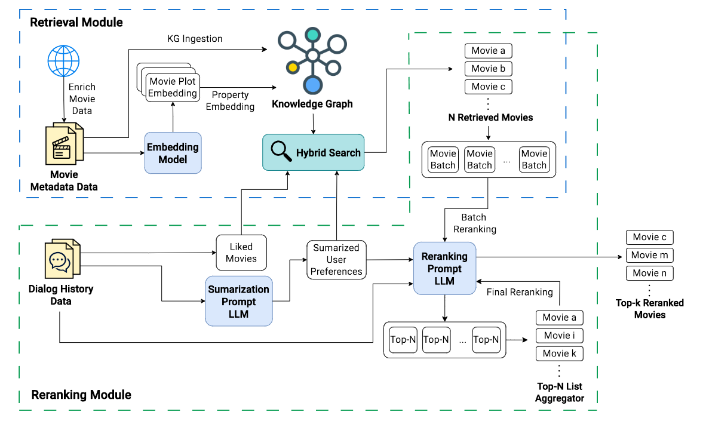

# Large Language Models for Conversational Recommendation Systems: Retrieval and Reranking

A comprehensive framework for building conversational movie recommendation systems using Large Language Models (LLMs) with advanced retrieval and reranking techniques. This project supports both **INSPIRED** and **REDIAL** datasets and implements hybrid approaches combining graph databases, vector embeddings, and LLM-based reranking.

## 🎯 Overview

This project implements a sophisticated conversational recommendation system that:

- **Retrieves** movie candidates using multiple methods (semantic similarity, content filtering, collaborative filtering)
- **Reranks** candidates using LLM-based reasoning
- **Supports** both INSPIRED and REDIAL datasets
- **Uses** Neo4j graph databases for structured movie relationships
- **Integrates** multiple LLM providers (Google Gemini, Llama, DeepSeek)
- **Provides** comprehensive evaluation metrics

## 🏗️ Architecture



## 📁 Project Structure

```
LargeLanguageModelsForCRS-RetrivalAndReranking/
├── main_graph.py                 # Main execution script with graph-based retrieval
├── main_old.py                   # Legacy script with vector-based retrieval
├── config.yaml                   # Configuration file for models and data paths
├── requirements.txt              # Python dependencies
├── .env                          # Environment variables (create this)
│
├── dataset/                      # Dataset storage
│   ├── INSPIRED/                # INSPIRED dataset
│   │   ├── raw/                 # Raw data files
│   │   └── processed/           # Processed data files
│   ├── REDIAL/                  # REDIAL dataset
│   │   ├── raw/                 # Raw data files
│   │   └── processed/           # Processed data files
│   └── embeddings/              # Vector embeddings storage
│
├── preprocessing/                # Data preprocessing scripts
│   ├── graph_builder.py         # Build Neo4j graph for REDIAL
│   ├── graph_builder_inspired.py # Build Neo4j graph for INSPIRED
│   ├── inspired.py              # INSPIRED data preprocessing
│   ├── redial.py                # REDIAL data preprocessing
│   └── generate_embedding.py    # Generate vector embeddings
│
├── utils/                        # Utility modules
│   ├── GraphDB/                 # Graph database utilities
│   │   └── graph_retriever.py   # Main graph retrieval logic
│   ├── LangChain/               # LangChain integration
│   ├── LlamaIndex/              # LlamaIndex integration
│   └── config_loader.py         # Configuration loader
│
├── evaluating/                   # Evaluation modules
│   ├── output_eval.py           # Main evaluation logic
│   └── calculate_recall_redial.py # REDIAL-specific metrics
│
├── output/                       # Output results
│   ├── INSPIRED/                # INSPIRED results
│   └── REDIAL/                  # REDIAL results
│
└── examples/                     # Example scripts and notebooks
```

## 🚀 Quick Start

### 1. Installation

```bash
# Clone the repository
git clone <repository-url>
cd LargeLanguageModelsForCRS-RetrivalAndReranking

# Install dependencies
pip install -r requirements.txt
```

### 2. Environment Setup

Create a `.env` file in the project root:

```bash
# Neo4j Configuration
NEO4J_URI=bolt://localhost
NEO4J_PORT_INSPIRED=7688    # Port for INSPIRED dataset
NEO4J_PORT_REDIAL=7687      # Port for REDIAL dataset
NEO4J_USER=neo4j
NEO4J_PASSWORD=your_password

# Google API Keys (for Gemini models)
GOOGLE_API_KEY_0=your_api_key_0
GOOGLE_API_KEY_1=your_api_key_1
# ... (up to GOOGLE_API_KEY_25 for load balancing)

# Azure OpenAI (for embeddings)
EMBEDDING__KEY=your_azure_openai_key
EMBEDDING__API_VERSION=2024-02-15-preview
EMBEDDING__ENDPOINT=https://your-resource.openai.azure.com/
EMBEDDING__DEPLOYMENT_NAME=your_deployment_name

# Concurrency settings
CONCURRENCY_LIMIT=10
```

### 3. Dataset Preparation

#### For INSPIRED Dataset:
```bash
# Build Neo4j graph database
python preprocessing/graph_builder_inspired.py
```

#### For REDIAL Dataset:
```bash
# Build Neo4j graph database
python preprocessing/graph_builder_redial.py
```

### 4. Run the System

```bash
# For INSPIRED dataset
python main_graph.py --data inspired --k 50 --n 400 --begin_row 0

# For REDIAL dataset
python main_graph.py --data redial --k 50 --n 400 --begin_row 0
```

## 🔧 Configuration

### Model Configuration (`config.yaml`)

```yaml
# Available LLM Models
GeminiModel:
  1.5_flash: "gemini-1.5-flash"
  2.0_flash: "gemini-2.0-flash"
  2.5_flash_lite: "gemini-2.5-flash-lite"

LlamaModel:
  llama_3.3_70b: "meta-llama/Llama-3.3-70B-Instruct-Turbo-Free"
  llama_3_8b: "meta-llama/Meta-Llama-3-8B-Instruct-Turbo"

# Embedding Models
EmbeddingModel:
  gecko: "text-embedding-004"
  gemini_exp: "gemini-embedding-exp-03-07"

# Dataset Paths
InspiredDataPath:
  processed:
    movie: "dataset/INSPIRED/processed/movie_data/movie_database_no_missing.json"
    dialog:
      test: "dataset/INSPIRED/processed/dialog_data/test_new_processed.json"

RedialDataPath:
  processed:
    movie: "dataset/REDIAL/processed/movie_data/movie_fix_year.json"
    dialog:
      test: "dataset/REDIAL/processed/dialog_data/test_data.json"
```

## 🎬 Supported Datasets

### INSPIRED Dataset
- **Format**: JSONL with movie metadata and dialog conversations
- **Features**: Movie titles, genres, directors, actors, plots, IMDB ratings
- **Graph Database**: Neo4j on port 7687
- **Special Handling**: Extracts liked movies from conversation context

### REDIAL Dataset
- **Format**: JSON with structured dialog and explicit liked movies
- **Features**: Movie metadata with collaborative filtering signals
- **Graph Database**: Neo4j on port 7688
- **Special Handling**: Uses explicit liked_movies field

## 🔍 Retrieval Methods

The system implements a **hybrid retrieval approach**:

### 1. Semantic Similarity
- Uses vector embeddings to find movies similar to user preferences
- Leverages Azure OpenAI embeddings for plot similarity

### 2. Content-Based Filtering
- LLM-enhanced filtering based on genre, director, actor preferences
- Uses graph relationships for enhanced matching

### 3. Collaborative Filtering
- Recursive collaborative filtering based on liked movies
- Exploits user-movie interaction patterns in the graph

### 4. Fallback Strategy
- Random popular movies when other methods fail
- Ensures consistent number of recommendations

## 🧠 Reranking

The system uses **LLM-based reranking** to:

- Understand nuanced user preferences from conversation context
- Consider multiple factors (genre, mood, actor preferences, etc.)
- Provide explainable recommendations
- Handle complex preference combinations

## 📊 Evaluation

The system provides comprehensive evaluation metrics:

- **Recall@K**: Percentage of relevant movies in top-K recommendations
- **MRR (Mean Reciprocal Rank)**: Average rank of first relevant movie
- **NDCG**: Normalized Discounted Cumulative Gain
- **Hit Rate**: Percentage of conversations with at least one relevant movie

## 🛠️ Advanced Usage

### Custom Model Configuration

```python
# In main_graph.py, modify these lines:
GENERATIVE_MODEL = config["GeminiModel"]["2.0_flash"]  # Change model here
```

### Batch Processing

```bash
# Process multiple batches
nohup python main_graph.py --data redial --k 50 --n 400 --begin_row 0 > log_50_400.txt 2>&1 &
nohup python main_graph.py --data redial --k 50 --n 400 --begin_row 400 > log_50_400_400.txt 2>&1 &
```

### Graph Database Management

```bash
# Clear Neo4j database (be careful!)
# Connect to Neo4j browser and run:
MATCH (n) DETACH DELETE n
```

## 🔧 Troubleshooting

### Common Issues

1. **Neo4j Connection Failed**
   - Check if Neo4j is running on correct ports
   - Verify credentials in `.env` file
   - Ensure firewall allows connections

2. **API Key Errors**
   - Verify all API keys in `.env` file
   - Check API quotas and limits
   - Ensure proper API key format

3. **Memory Issues**
   - Reduce `CONCURRENCY_LIMIT` in `.env`
   - Process smaller batches with `--n` parameter
   - Increase system memory or use swap

4. **Dataset Not Found**
   - Verify dataset paths in `config.yaml`
   - Run preprocessing scripts first
   - Check file permissions

### Performance Optimization

- **Concurrency**: Adjust `CONCURRENCY_LIMIT` based on system resources
- **Batch Size**: Use appropriate `--n` values for memory constraints
- **Model Selection**: Use lighter models (e.g., `llama_3_8b`) for faster processing
- **Graph Indexing**: Create indexes on frequently queried properties in Neo4j

## 📈 Results and Output

Results are saved in the `output/` directory with detailed metrics:

```
output/
├── INSPIRED/
└── REDIAL/
```

## 🤝 Contributing

1. Fork the repository
2. Create a feature branch
3. Make your changes
4. Add tests if applicable
5. Submit a pull request

## 📄 License

This project is licensed under the MIT License - see the LICENSE file for details.


## 📞 Support

For questions and support:
- Create an issue in the repository
- Check the troubleshooting section
- Review the configuration examples

---


**Note**: This system requires significant computational resources and API access. Ensure you have adequate quotas and system specifications before running large-scale experiments.
