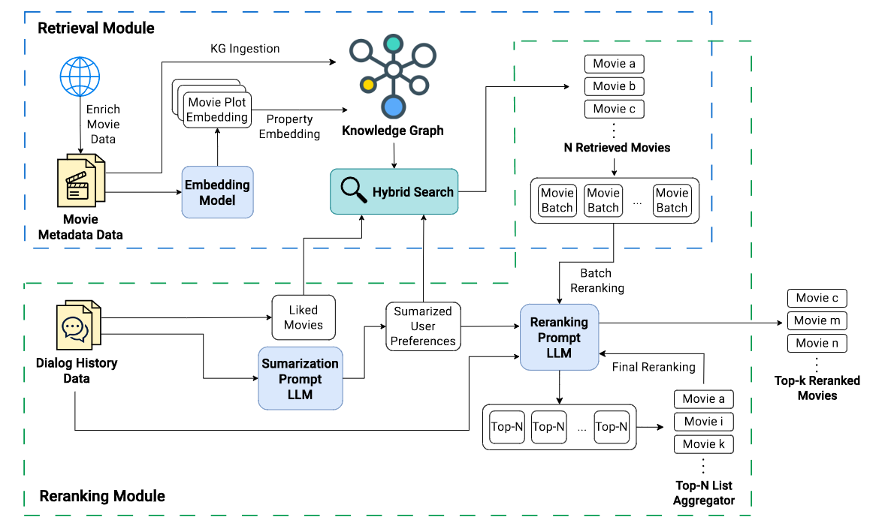
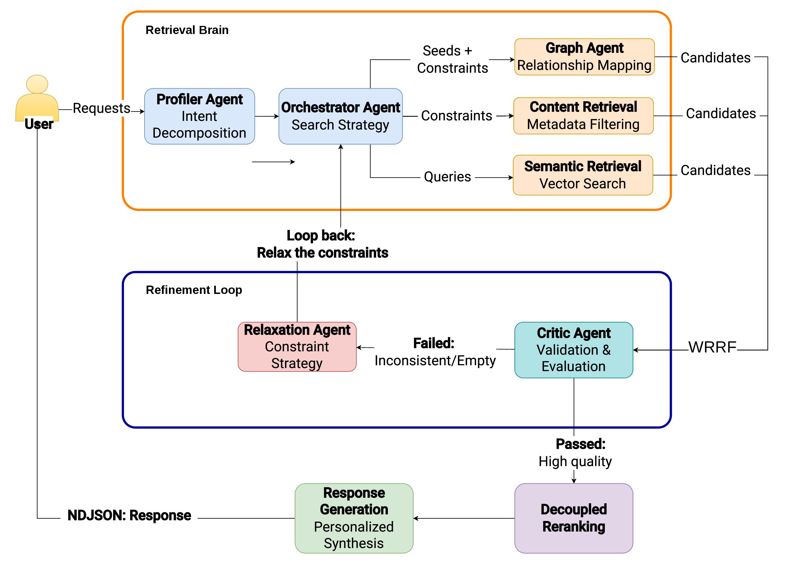
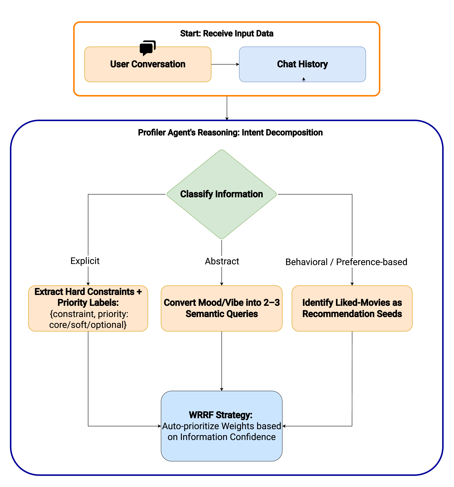
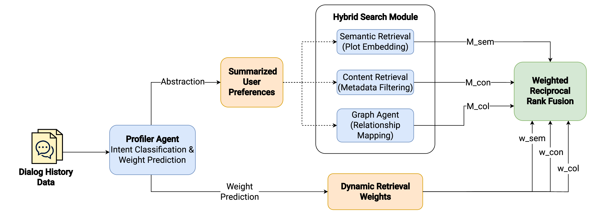
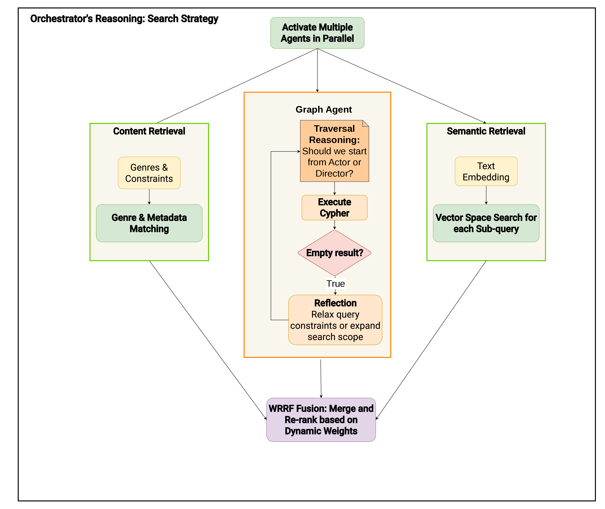
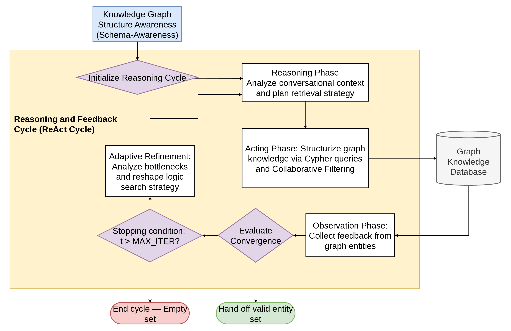
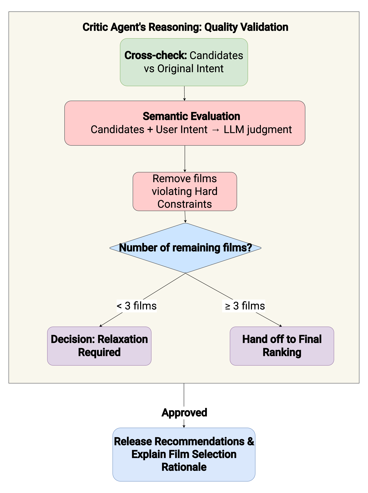
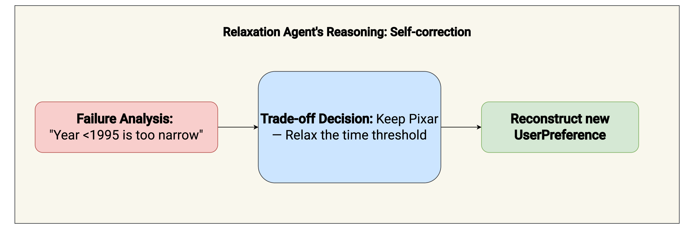
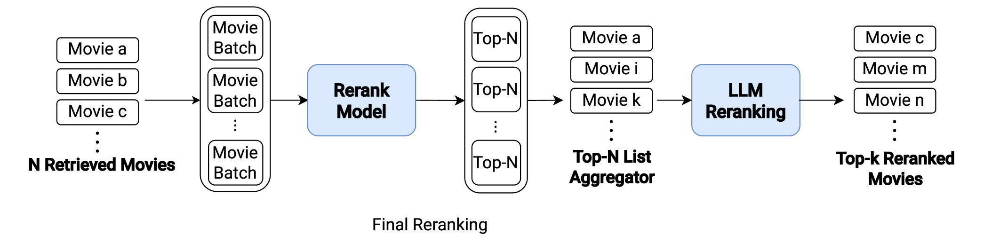

# Large Language Models for Conversational Recommendation Systems: Retrieval and Reranking

A comprehensive framework for building conversational movie recommendation systems using Large Language Models (LLMs) with advanced retrieval and reranking techniques. This project supports both **INSPIRED** and **REDIAL** datasets and implements hybrid approaches combining graph databases, vector embeddings, and LLM-based reranking.

## 🎯 Overview

This project implements a sophisticated conversational recommendation system that:

- **Retrieves** movie candidates using multiple methods (semantic similarity, content filtering, collaborative filtering)
- **Reranks** candidates using LLM-based reasoning
- **Supports** both INSPIRED and REDIAL datasets
- **Uses** Neo4j graph databases for structured movie relationships
- **Integrates** multiple LLM providers (Google Gemini, Llama, DeepSeek)
- **Provides** comprehensive evaluation metrics

## 🏗️ Architecture



## 📁 Project Structure

```
LargeLanguageModelsForCRS-RetrivalAndReranking/
├── main_graph.py                 # Main execution script with graph-based retrieval
├── main_old.py                   # Legacy script with vector-based retrieval
├── config.yaml                   # Configuration file for models and data paths
├── requirements.txt              # Python dependencies
├── .env                          # Environment variables (create this)
│
├── dataset/                      # Dataset storage
│   ├── INSPIRED/                # INSPIRED dataset
│   │   ├── raw/                 # Raw data files
│   │   └── processed/           # Processed data files
│   ├── REDIAL/                  # REDIAL dataset
│   │   ├── raw/                 # Raw data files
│   │   └── processed/           # Processed data files
│   └── embeddings/              # Vector embeddings storage
│
├── preprocessing/                # Data preprocessing scripts
│   ├── graph_builder.py         # Build Neo4j graph for REDIAL
│   ├── graph_builder_inspired.py # Build Neo4j graph for INSPIRED
│   ├── inspired.py              # INSPIRED data preprocessing
│   ├── redial.py                # REDIAL data preprocessing
│   └── generate_embedding.py    # Generate vector embeddings
│
├── utils/                        # Utility modules
│   ├── GraphDB/                 # Graph database utilities
│   │   └── graph_retriever.py   # Main graph retrieval logic
│   ├── LangChain/               # LangChain integration
│   ├── LlamaIndex/              # LlamaIndex integration
│   └── config_loader.py         # Configuration loader
│
├── evaluating/                   # Evaluation modules
│   ├── output_eval.py           # Main evaluation logic
│   └── calculate_recall_redial.py # REDIAL-specific metrics
│
├── output/                       # Output results
│   ├── INSPIRED/                # INSPIRED results
│   └── REDIAL/                  # REDIAL results
│
└── examples/                     # Example scripts and notebooks
```

## 🚀 Quick Start

### 1. Installation

```bash
# Clone the repository
git clone <repository-url>
cd LargeLanguageModelsForCRS-RetrivalAndReranking

# Install dependencies
pip install -r requirements.txt
```

### 2. Environment Setup

Create a `.env` file in the project root:

```bash
# Neo4j Configuration
NEO4J_URI=bolt://localhost
NEO4J_PORT_INSPIRED=7688    # Port for INSPIRED dataset
NEO4J_PORT_REDIAL=7687      # Port for REDIAL dataset
NEO4J_USER=neo4j
NEO4J_PASSWORD=your_password

# Google API Keys (for Gemini models)
GOOGLE_API_KEY_0=your_api_key_0
GOOGLE_API_KEY_1=your_api_key_1
# ... (up to GOOGLE_API_KEY_25 for load balancing)

# Azure OpenAI (for embeddings)
EMBEDDING__KEY=your_azure_openai_key
EMBEDDING__API_VERSION=2024-02-15-preview
EMBEDDING__ENDPOINT=https://your-resource.openai.azure.com/
EMBEDDING__DEPLOYMENT_NAME=your_deployment_name

# Concurrency settings
CONCURRENCY_LIMIT=10
```

### 3. Dataset Preparation

#### For INSPIRED Dataset:
```bash
# Build Neo4j graph database
python preprocessing/graph_builder_inspired.py
```

#### For REDIAL Dataset:
```bash
# Build Neo4j graph database
python preprocessing/graph_builder_redial.py
```

### 4. Run the System

```bash
# For INSPIRED dataset
python main_graph.py --data inspired --k 50 --n 400 --begin_row 0

# For REDIAL dataset
python main_graph.py --data redial --k 50 --n 400 --begin_row 0
```

## 🔧 Configuration

### Model Configuration (`config.yaml`)

```yaml
# Available LLM Models
GeminiModel:
  1.5_flash: "gemini-1.5-flash"
  2.0_flash: "gemini-2.0-flash"
  2.5_flash_lite: "gemini-2.5-flash-lite"

LlamaModel:
  llama_3.3_70b: "meta-llama/Llama-3.3-70B-Instruct-Turbo-Free"
  llama_3_8b: "meta-llama/Meta-Llama-3-8B-Instruct-Turbo"

# Embedding Models
EmbeddingModel:
  gecko: "text-embedding-004"
  gemini_exp: "gemini-embedding-exp-03-07"

# Dataset Paths
InspiredDataPath:
  processed:
    movie: "dataset/INSPIRED/processed/movie_data/movie_database_no_missing.json"
    dialog:
      test: "dataset/INSPIRED/processed/dialog_data/test_new_processed.json"

RedialDataPath:
  processed:
    movie: "dataset/REDIAL/processed/movie_data/movie_fix_year.json"
    dialog:
      test: "dataset/REDIAL/processed/dialog_data/test_data.json"
```

## 🎬 Supported Datasets

### INSPIRED Dataset
- **Format**: JSONL with movie metadata and dialog conversations
- **Features**: Movie titles, genres, directors, actors, plots, IMDB ratings
- **Graph Database**: Neo4j on port 7687
- **Special Handling**: Extracts liked movies from conversation context

### REDIAL Dataset
- **Format**: JSON with structured dialog and explicit liked movies
- **Features**: Movie metadata with collaborative filtering signals
- **Graph Database**: Neo4j on port 7688
- **Special Handling**: Uses explicit liked_movies field

## 🔍 Retrieval Methods

The system implements a **hybrid retrieval approach**:

### 1. Semantic Similarity
- Uses vector embeddings to find movies similar to user preferences
- Leverages Azure OpenAI embeddings for plot similarity

### 2. Content-Based Filtering
- LLM-enhanced filtering based on genre, director, actor preferences
- Uses graph relationships for enhanced matching

### 3. Collaborative Filtering
- Recursive collaborative filtering based on liked movies
- Exploits user-movie interaction patterns in the graph

### 4. Fallback Strategy
- Random popular movies when other methods fail
- Ensures consistent number of recommendations

## 🧠 Reranking

The system uses **LLM-based reranking** to:

- Understand nuanced user preferences from conversation context
- Consider multiple factors (genre, mood, actor preferences, etc.)
- Provide explainable recommendations
- Handle complex preference combinations

## 📊 Evaluation

The system provides comprehensive evaluation metrics:

- **Recall@K**: Percentage of relevant movies in top-K recommendations
- **MRR (Mean Reciprocal Rank)**: Average rank of first relevant movie
- **NDCG**: Normalized Discounted Cumulative Gain
- **Hit Rate**: Percentage of conversations with at least one relevant movie

## 🛠️ Advanced Usage

### Custom Model Configuration

```python
# In main_graph.py, modify these lines:
GENERATIVE_MODEL = config["GeminiModel"]["2.0_flash"]  # Change model here
```

### Batch Processing

```bash
# Process multiple batches
nohup python main_graph.py --data redial --k 50 --n 400 --begin_row 0 > log_50_400.txt 2>&1 &
nohup python main_graph.py --data redial --k 50 --n 400 --begin_row 400 > log_50_400_400.txt 2>&1 &
```

### Graph Database Management

```bash
# Clear Neo4j database (be careful!)
# Connect to Neo4j browser and run:
MATCH (n) DETACH DELETE n
```

## 🔧 Troubleshooting

### Common Issues

1. **Neo4j Connection Failed**
   - Check if Neo4j is running on correct ports
   - Verify credentials in `.env` file
   - Ensure firewall allows connections

2. **API Key Errors**
   - Verify all API keys in `.env` file
   - Check API quotas and limits
   - Ensure proper API key format

3. **Memory Issues**
   - Reduce `CONCURRENCY_LIMIT` in `.env`
   - Process smaller batches with `--n` parameter
   - Increase system memory or use swap

4. **Dataset Not Found**
   - Verify dataset paths in `config.yaml`
   - Run preprocessing scripts first
   - Check file permissions

### Performance Optimization

- **Concurrency**: Adjust `CONCURRENCY_LIMIT` based on system resources
- **Batch Size**: Use appropriate `--n` values for memory constraints
- **Model Selection**: Use lighter models (e.g., `llama_3_8b`) for faster processing
- **Graph Indexing**: Create indexes on frequently queried properties in Neo4j

## 📈 Results and Output

Results are saved in the `output/` directory with detailed metrics:

```
output/
├── INSPIRED/
└── REDIAL/
```

## 🤝 Contributing

1. Fork the repository
2. Create a feature branch
3. Make your changes
4. Add tests if applicable
5. Submit a pull request

## 📄 License

This project is licensed under the MIT License - see the LICENSE file for details.


## 📞 Support

For questions and support:
- Create an issue in the repository
- Check the troubleshooting section
- Review the configuration examples

---


**Note**: This system requires significant computational resources and API access. Ensure you have adequate quotas and system specifications before running large-scale experiments.

---

# ARGOS — Adaptive Reasoning and Graph Orchestration System

ARGOS is the next-generation multi-agent Conversational Recommendation System (CRS) built on top of GRACE. It replaces the static linear pipeline with a **multi-agent feedback loop**, introducing self-correction, dynamic retrieval weighting, and constraint relaxation — enabling the system to recover from hard-constraint failures rather than returning empty results.

## Overview

Where GRACE processes each query in a single pass (profile → retrieve → rerank), ARGOS wraps that logic in an agentic feedback loop:

- **Profiler Agent** decomposes user intent into structured constraints + semantic queries + dynamic WRRF weights
- **Orchestrator Agent** runs three retrieval streams in parallel and fuses results with dynamic WRRF
- **Graph Agent** queries Neo4j via a ReAct reasoning loop with schema-aware Cypher generation
- **Critic Agent** cross-validates all candidates against hard constraints and triggers relaxation when needed
- **Relaxation Agent** loosens non-core constraints via a sacrifice hierarchy and reconstructs intent for a second attempt
- **Decoupled Reranker** filters with a Cross-Encoder (SLM) then reasons with a Generative LLM

## Architecture



## Agent Components

### Profiler Agent — Intent Decomposition & Adaptive Routing

The Profiler Agent is the entry point of every turn. It classifies each piece of user information into three independent branches:

| Branch | Output | Consumer |
|---|---|---|
| **Explicit** (named entities, thresholds) | `hard_constraints` list with `core/soft/optional` priority labels | Graph Agent (Cypher WHERE), Critic Agent (verification), Relaxation Agent (sacrifice hierarchy) |
| **Abstract** (mood, vibe, comparisons) | `semantic_queries` — multi-query expansion set $Q = \{q_1 \dots q_n\}$ | Semantic Retrieval |
| **Behavioral** (liked movies) | `liked_movies` recommendation seeds | Graph Agent (anchor nodes for collaborative traversal) |

In parallel, the Profiler predicts the WRRF weight vector $\mathbf{w} = (w_\text{sem}, w_\text{con}, w_\text{col})^\intercal$ based on query characteristics — high $w_\text{col}$ for entity-heavy queries, high $w_\text{sem}$ for emotional/descriptive ones — so retrieval routing is ready before any stream fires.





### Orchestrator Agent — Asynchronous Parallel Retrieval + Dynamic WRRF

The Orchestrator fires all three retrieval streams concurrently via `asyncio.gather()`:

- **Semantic Retrieval** — dense vector search (Chroma) over `semantic_queries`
- **Content Retrieval** — structured filtering on `genres` and metadata fields
- **Graph Agent** — multi-hop Neo4j traversal with a ReAct loop (≤ 3 turns, 3 s timeout with early-stop fallback)

Results are merged with **Weighted Reciprocal Rank Fusion**:

$$\operatorname{WRRF}(i) = \sum_{m \in \{\text{sem, con, col}\}} \frac{w_m}{k + R_m(i)}$$

The dynamic weights $w_m$ (from Profiler) replace the fixed $(0.40, 0.35, 0.25)$ used in GRACE, amplifying whichever stream best matches the current query type.



### Graph Agent — Schema-Aware ReAct Loop

The Graph Agent combines two parallel query strategies using the full KG schema injected into its system prompt:

1. **Constraint filtering** — translates `hard_constraints` into Cypher `WHERE` clauses (e.g. `WHERE y.value >= 2010`)
2. **Collaborative traversal** — expands from `liked_movies` anchor nodes via `ACTED_IN` / `DIRECTED` relationships

Each turn follows the ReAct cycle: **Thought** → **Action** (Cypher query) → **Observation** (Neo4j result). On empty results or syntax errors, the agent self-corrects and retries within the 3-turn budget.



### Critic Agent — Cross-Stream Quality Gate

After WRRF fusion, the Critic Agent performs **cross-stream verification**: candidates from Semantic and Content retrieval are not pre-filtered by hard constraints, so the Critic checks all candidates uniformly against the full `hard_constraints` list using a single LLM semantic pass (not Boolean field matching).

If the valid candidate set $|M_\text{valid}| < \tau$ (default $\tau = 3$), the Critic emits a `Relaxation_Required` signal along with a `critic_reasoning` report that identifies which constraint caused the bottleneck.



### Relaxation Agent — Graceful Degradation

When the Critic signals failure, the Relaxation Agent applies the **Sacrifice Hierarchy** using the `priority` labels set by Profiler:

| Tier | Examples | Action |
|---|---|---|
| `core` — inviolable | Genre, explicit content limits | Never relaxed |
| `soft` — relax first | Exact year, multi-entity intersection | Widen range or convert AND → OR |
| `optional` — drop if needed | Studio, country, cinematography style | Remove entirely |

The agent only touches the constraint causing the bottleneck (minimal relaxation), then **reconstructs intent** into a fresh `UserPreference` object — schema-compatible with Profiler output — and hands it back to the Orchestrator for Attempt 2.



### Decoupled Reranker — 2-Stage Filtering

ARGOS replaces GRACE's all-LLM reranking with a two-stage pipeline to combat *lost-in-the-middle* degradation and $O(N^2)$ attention cost:

| Stage | Model | Input → Output |
|---|---|---|
| **Stage 1** | Cross-Encoder SLM | All candidates → batched scoring → Top-20 aggregated |
| **Stage 2** | Generative LLM | Top-20 → reasoning over diversity, serendipity, history → Top-5 final |



## Pipeline Flow

```
profiler_node → orchestrator_node → retrieval_node → critic_node
    ↑                                                      ↓
    └──────────── relaxation_node (if critic fails) ←──────┘
                                        ↓
                              reranker_node → generator_node
```

The `requires_relaxation` flag and `attempt` counter on `ARGOSState` control the retry loop. The system enforces a maximum of 2 attempts before falling back gracefully.

## Project Structure

```
GRACE/
├── backend/                         # Python 3.12 (uv), FastAPI + LangGraph
│   ├── app/chat/                    # LangGraph pipeline (graph.py, state.py, nodes/)
│   ├── domain/                      # Business logic: agent/, retrieval/, reranking/, evaluation/
│   ├── infra/                       # PostgreSQL, Neo4j, LLM/embedding clients
│   └── api/                         # FastAPI routers: /chat/, /evaluate/, /tracing/
├── frontend/                        # React + Vite + TypeScript
│   └── src/
│       ├── components/ChatInterface.tsx   # Streaming agent progress
│       └── lib/api.ts                     # Axios + NDJSON streaming
└── latex/KLTN Final/                # Thesis LaTeX source (Chap1–Chap6)
```

## Quick Start

### Backend

```bash
cd backend
uv sync
cp .env.example .env          # fill in credentials (see Configuration below)
uvicorn api:app --host 0.0.0.0 --port 8000 --reload
```

### Frontend

```bash
cd frontend
npm install
npm run dev                   # http://localhost:5173
```

### Docker Compose (full stack with Neo4j + PostgreSQL)

```bash
docker-compose up -d
docker-compose logs -f retrieval_service
```

## Configuration

Required environment variables (`.env`):

```bash
# LLM provider — pick one: azure | openai | gemini
LLM_PROVIDER=azure

# Azure OpenAI
AZURE_OPENAI_API_KEY=...
AZURE_OPENAI_ENDPOINT=...
AZURE_LLM_MODEL=...
AZURE_EMBEDDING_MODEL=...

# OpenAI (if LLM_PROVIDER=openai)
# OPENAI_API_KEY=...

# Gemini (if LLM_PROVIDER=gemini)
# GEMINI_API_KEY=...

# Neo4j
NEO4J_URI=bolt://localhost
NEO4J_PORT=7687
NEO4J_USER=neo4j
NEO4J_PASSWORD=...

# PostgreSQL
POSTGRES_USER=postgres
POSTGRES_PASSWORD=postgres
POSTGRES_DB=grace
POSTGRES_SERVER=localhost

# Cohere reranking (optional)
AWS_LLM_ACCESS_KEY_ID=...
AWS_LLM_SECRET_ACCESS_KEY=...
AWS_LLM_REGION=...
```

## Evaluation

```bash
cd backend
uv run python scripts/run_argos_inspired_eval.py --sample-size 50
uv run python scripts/run_argos_redial_eval.py   --sample-size 50
```

Metric: **Recall@K** — results stored in PostgreSQL and viewable from the `/eval` frontend route.
